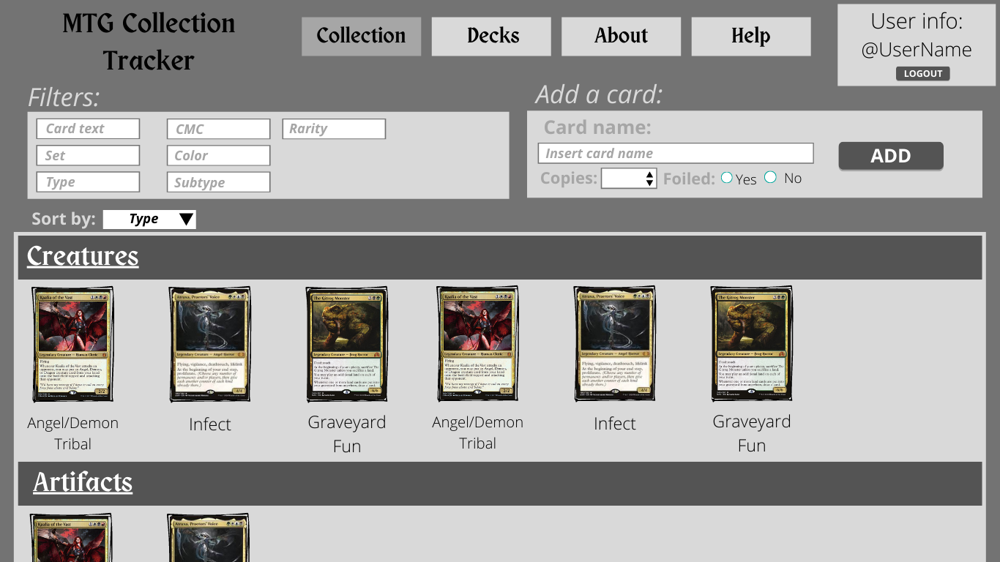
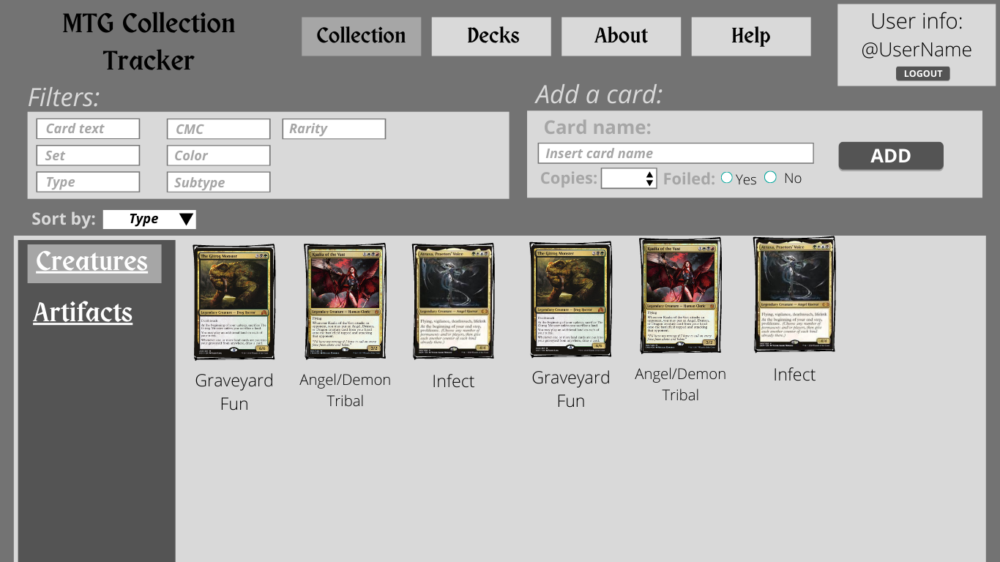
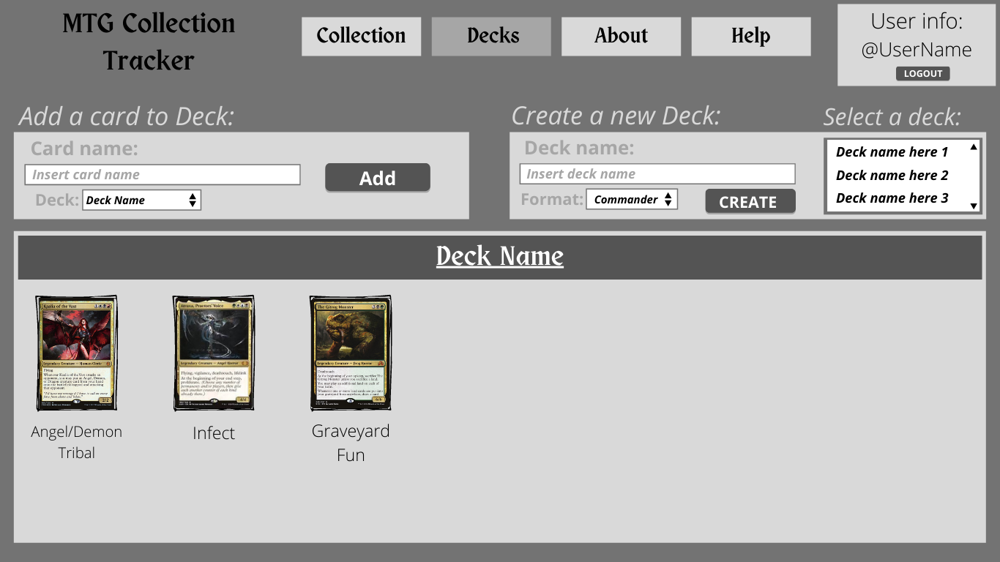

# capstone_MTG-Collection-Tracker
# Description: 
This project is a basic webapp product that helps MTG players catalog and organize their Magic the gathering collections and create decks with their own cards.

# Members 
This group is composed by Geraldo Pereira Junior, AJ Fischer, and Zeke Arthur Huebler.

# Technology
The tech stack used for this project is mainly HTML, CSS, JavaScript, Node.js for backend, and Postgres for database. We will also be using Heroku services to host our webapp. We are also using magicthegathering.io as our api and access it through javascript sdk.

# Current Designs of project 

This file will be updated along the project development.